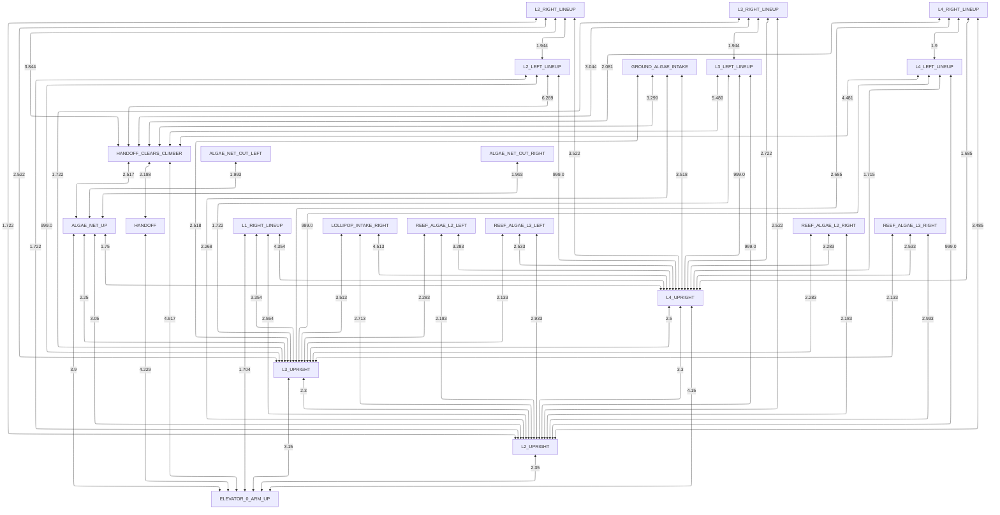

# Collision avoidance (left obstructed)

```mermaid
%%{ init: { "flowchart": { "defaultRenderer": "elk" } } }%%
graph TD

L2_UPRIGHT <-- 2.35 --> ELEVATOR_0_ARM_UP
L3_UPRIGHT <-- 3.15 --> ELEVATOR_0_ARM_UP
L4_UPRIGHT <-- 4.15 --> ELEVATOR_0_ARM_UP
ALGAE_NET_UP <-- 3.9 --> ELEVATOR_0_ARM_UP
HANDOFF <-- 4.229 --> ELEVATOR_0_ARM_UP
HANDOFF_CLEARS_CLIMBER <-- 4.917 --> ELEVATOR_0_ARM_UP
L1_RIGHT_LINEUP <-- 1.704 --> ELEVATOR_0_ARM_UP
L3_UPRIGHT <-- 2.3 --> L2_UPRIGHT
L4_UPRIGHT <-- 3.3 --> L2_UPRIGHT
ALGAE_NET_UP <-- 3.05 --> L2_UPRIGHT
L2_LEFT_LINEUP <-- 1.722 --> L2_UPRIGHT
L2_RIGHT_LINEUP <-- 1.722 --> L2_UPRIGHT
GROUND_ALGAE_INTAKE <-- 2.268 --> L2_UPRIGHT
LOLLIPOP_INTAKE_RIGHT <-- 2.713 --> L2_UPRIGHT
REEF_ALGAE_L2_LEFT <-- 2.183 --> L2_UPRIGHT
REEF_ALGAE_L3_LEFT <-- 2.933 --> L2_UPRIGHT
REEF_ALGAE_L2_RIGHT <-- 2.183 --> L2_UPRIGHT
REEF_ALGAE_L3_RIGHT <-- 2.933 --> L2_UPRIGHT
L3_LEFT_LINEUP <-- 999.0 --> L2_UPRIGHT
L4_LEFT_LINEUP <-- 999.0 --> L2_UPRIGHT
L1_RIGHT_LINEUP <-- 2.554 --> L2_UPRIGHT
L3_RIGHT_LINEUP <-- 2.522 --> L2_UPRIGHT
L4_RIGHT_LINEUP <-- 3.485 --> L2_UPRIGHT
L4_UPRIGHT <-- 2.5 --> L3_UPRIGHT
ALGAE_NET_UP <-- 2.25 --> L3_UPRIGHT
L3_LEFT_LINEUP <-- 1.722 --> L3_UPRIGHT
L3_RIGHT_LINEUP <-- 1.722 --> L3_UPRIGHT
GROUND_ALGAE_INTAKE <-- 2.518 --> L3_UPRIGHT
LOLLIPOP_INTAKE_RIGHT <-- 3.513 --> L3_UPRIGHT
REEF_ALGAE_L2_LEFT <-- 2.283 --> L3_UPRIGHT
REEF_ALGAE_L3_LEFT <-- 2.133 --> L3_UPRIGHT
REEF_ALGAE_L2_RIGHT <-- 2.283 --> L3_UPRIGHT
REEF_ALGAE_L3_RIGHT <-- 2.133 --> L3_UPRIGHT
L2_LEFT_LINEUP <-- 999.0 --> L3_UPRIGHT
L4_LEFT_LINEUP <-- 999.0 --> L3_UPRIGHT
L1_RIGHT_LINEUP <-- 3.354 --> L3_UPRIGHT
L2_RIGHT_LINEUP <-- 2.522 --> L3_UPRIGHT
L4_RIGHT_LINEUP <-- 2.685 --> L3_UPRIGHT
ALGAE_NET_UP <-- 1.75 --> L4_UPRIGHT
L4_LEFT_LINEUP <-- 1.715 --> L4_UPRIGHT
L4_RIGHT_LINEUP <-- 1.685 --> L4_UPRIGHT
GROUND_ALGAE_INTAKE <-- 3.518 --> L4_UPRIGHT
LOLLIPOP_INTAKE_RIGHT <-- 4.513 --> L4_UPRIGHT
REEF_ALGAE_L2_LEFT <-- 3.283 --> L4_UPRIGHT
REEF_ALGAE_L3_LEFT <-- 2.533 --> L4_UPRIGHT
REEF_ALGAE_L2_RIGHT <-- 3.283 --> L4_UPRIGHT
REEF_ALGAE_L3_RIGHT <-- 2.533 --> L4_UPRIGHT
L2_LEFT_LINEUP <-- 999.0 --> L4_UPRIGHT
L3_LEFT_LINEUP <-- 999.0 --> L4_UPRIGHT
L1_RIGHT_LINEUP <-- 4.354 --> L4_UPRIGHT
L2_RIGHT_LINEUP <-- 3.522 --> L4_UPRIGHT
L3_RIGHT_LINEUP <-- 2.722 --> L4_UPRIGHT
HANDOFF_CLEARS_CLIMBER <-- 2.517 --> ALGAE_NET_UP
ALGAE_NET_OUT_LEFT <-- 1.993 --> ALGAE_NET_UP
ALGAE_NET_OUT_RIGHT <-- 1.993 --> ALGAE_NET_UP
HANDOFF_CLEARS_CLIMBER <-- 2.188 --> HANDOFF
L2_LEFT_LINEUP <-- 6.289 --> HANDOFF_CLEARS_CLIMBER
L3_LEFT_LINEUP <-- 5.489 --> HANDOFF_CLEARS_CLIMBER
L4_LEFT_LINEUP <-- 4.481 --> HANDOFF_CLEARS_CLIMBER
L2_RIGHT_LINEUP <-- 3.844 --> HANDOFF_CLEARS_CLIMBER
L3_RIGHT_LINEUP <-- 3.044 --> HANDOFF_CLEARS_CLIMBER
L4_RIGHT_LINEUP <-- 2.081 --> HANDOFF_CLEARS_CLIMBER
GROUND_ALGAE_INTAKE <-- 3.299 --> HANDOFF_CLEARS_CLIMBER
L2_RIGHT_LINEUP <-- 1.944 --> L2_LEFT_LINEUP
L3_RIGHT_LINEUP <-- 1.944 --> L3_LEFT_LINEUP
L4_RIGHT_LINEUP <-- 1.9 --> L4_LEFT_LINEUP
```
