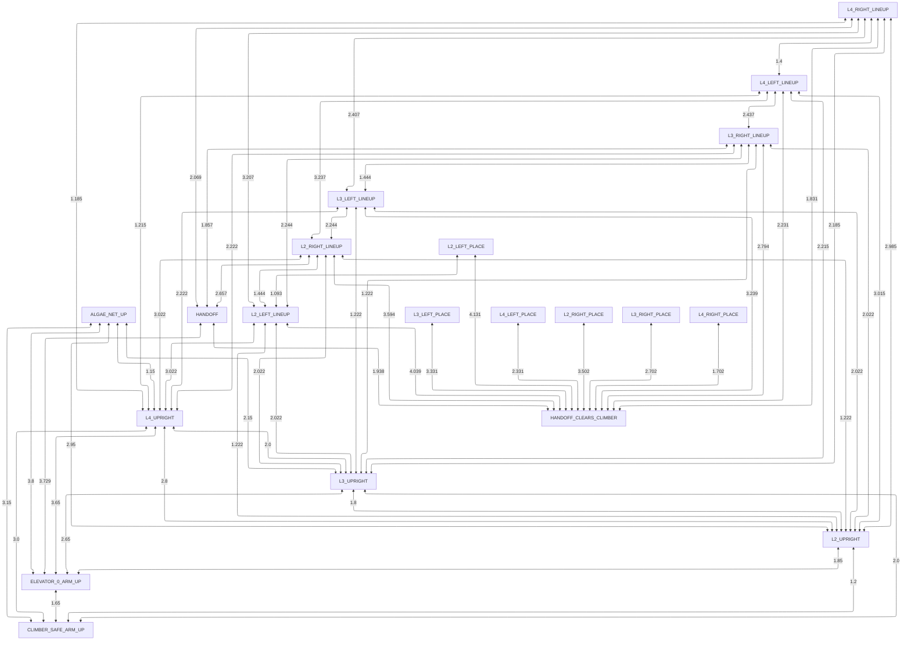

# Collision avoidance (left obstructed)

```mermaid
%%{ init: { "flowchart": { "defaultRenderer": "elk" } } }%%
graph TD

ELEVATOR_0_ARM_UP <-- 1.65 --> CLIMBER_SAFE_ARM_UP
L2_UPRIGHT <-- 1.2 --> CLIMBER_SAFE_ARM_UP
L3_UPRIGHT <-- 2.0 --> CLIMBER_SAFE_ARM_UP
L4_UPRIGHT <-- 3.0 --> CLIMBER_SAFE_ARM_UP
ALGAE_NET_UP <-- 3.15 --> CLIMBER_SAFE_ARM_UP
L2_UPRIGHT <-- 1.85 --> ELEVATOR_0_ARM_UP
L3_UPRIGHT <-- 2.65 --> ELEVATOR_0_ARM_UP
L4_UPRIGHT <-- 3.65 --> ELEVATOR_0_ARM_UP
ALGAE_NET_UP <-- 3.8 --> ELEVATOR_0_ARM_UP
HANDOFF <-- 3.729 --> ELEVATOR_0_ARM_UP
L3_UPRIGHT <-- 1.8 --> L2_UPRIGHT
L4_UPRIGHT <-- 2.8 --> L2_UPRIGHT
ALGAE_NET_UP <-- 2.95 --> L2_UPRIGHT
L2_LEFT_LINEUP <-- 1.222 --> L2_UPRIGHT
L2_RIGHT_LINEUP <-- 1.222 --> L2_UPRIGHT
L3_LEFT_LINEUP <-- 2.022 --> L2_UPRIGHT
L4_LEFT_LINEUP <-- 3.015 --> L2_UPRIGHT
L3_RIGHT_LINEUP <-- 2.022 --> L2_UPRIGHT
L4_RIGHT_LINEUP <-- 2.985 --> L2_UPRIGHT
L4_UPRIGHT <-- 2.0 --> L3_UPRIGHT
ALGAE_NET_UP <-- 2.15 --> L3_UPRIGHT
L3_LEFT_LINEUP <-- 1.222 --> L3_UPRIGHT
L3_RIGHT_LINEUP <-- 1.222 --> L3_UPRIGHT
L2_LEFT_LINEUP <-- 2.022 --> L3_UPRIGHT
L4_LEFT_LINEUP <-- 2.215 --> L3_UPRIGHT
L2_RIGHT_LINEUP <-- 2.022 --> L3_UPRIGHT
L4_RIGHT_LINEUP <-- 2.185 --> L3_UPRIGHT
ALGAE_NET_UP <-- 1.15 --> L4_UPRIGHT
L4_LEFT_LINEUP <-- 1.215 --> L4_UPRIGHT
L4_RIGHT_LINEUP <-- 1.185 --> L4_UPRIGHT
L2_LEFT_LINEUP <-- 3.022 --> L4_UPRIGHT
L3_LEFT_LINEUP <-- 2.222 --> L4_UPRIGHT
L2_RIGHT_LINEUP <-- 3.022 --> L4_UPRIGHT
L3_RIGHT_LINEUP <-- 2.222 --> L4_UPRIGHT
HANDOFF <-- 1.938 --> HANDOFF_CLEARS_CLIMBER
L2_LEFT_LINEUP <-- 4.039 --> HANDOFF_CLEARS_CLIMBER
L3_LEFT_LINEUP <-- 3.239 --> HANDOFF_CLEARS_CLIMBER
L4_LEFT_LINEUP <-- 2.231 --> HANDOFF_CLEARS_CLIMBER
L2_RIGHT_LINEUP <-- 3.594 --> HANDOFF_CLEARS_CLIMBER
L3_RIGHT_LINEUP <-- 2.794 --> HANDOFF_CLEARS_CLIMBER
L4_RIGHT_LINEUP <-- 1.831 --> HANDOFF_CLEARS_CLIMBER
L2_LEFT_PLACE <-- 4.131 --> HANDOFF_CLEARS_CLIMBER
L3_LEFT_PLACE <-- 3.331 --> HANDOFF_CLEARS_CLIMBER
L4_LEFT_PLACE <-- 2.331 --> HANDOFF_CLEARS_CLIMBER
L2_RIGHT_PLACE <-- 3.502 --> HANDOFF_CLEARS_CLIMBER
L3_RIGHT_PLACE <-- 2.702 --> HANDOFF_CLEARS_CLIMBER
L4_RIGHT_PLACE <-- 1.702 --> HANDOFF_CLEARS_CLIMBER
L2_RIGHT_LINEUP <-- 2.657 --> HANDOFF
L3_RIGHT_LINEUP <-- 1.857 --> HANDOFF
L4_RIGHT_LINEUP <-- 2.069 --> HANDOFF
L2_RIGHT_LINEUP <-- 1.444 --> L2_LEFT_LINEUP
L3_RIGHT_LINEUP <-- 2.244 --> L2_LEFT_LINEUP
L4_RIGHT_LINEUP <-- 3.207 --> L2_LEFT_LINEUP
L2_LEFT_PLACE <-- 1.093 --> L2_LEFT_LINEUP
L3_LEFT_LINEUP <-- 2.244 --> L2_RIGHT_LINEUP
L4_LEFT_LINEUP <-- 3.237 --> L2_RIGHT_LINEUP
L3_RIGHT_LINEUP <-- 1.444 --> L3_LEFT_LINEUP
L4_RIGHT_LINEUP <-- 2.407 --> L3_LEFT_LINEUP
L4_LEFT_LINEUP <-- 2.437 --> L3_RIGHT_LINEUP
L4_RIGHT_LINEUP <-- 1.4 --> L4_LEFT_LINEUP
```
