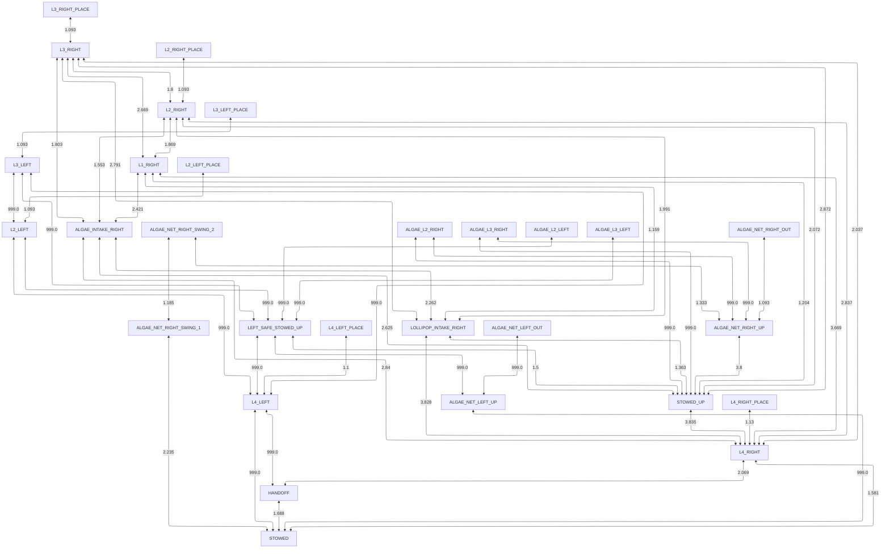

# Collision avoidance (left obstructed)

```mermaid
%%{ init: { "flowchart": { "defaultRenderer": "elk" } } }%%
graph TD

HANDOFF <-- 1.688 --> STOWED
L4_LEFT <-- 999.0 --> STOWED
L4_RIGHT <-- 1.581 --> STOWED
ALGAE_NET_LEFT_UP <-- 999.0 --> STOWED
ALGAE_NET_RIGHT_SWING_1 <-- 2.235 --> STOWED
L4_LEFT <-- 999.0 --> HANDOFF
L4_RIGHT <-- 2.069 --> HANDOFF
LEFT_SAFE_STOWED_UP <-- 999.0 --> L4_LEFT
L2_LEFT <-- 999.0 --> L4_LEFT
L3_LEFT <-- 999.0 --> L4_LEFT
L4_LEFT_PLACE <-- 1.1 --> L4_LEFT
STOWED_UP <-- 3.835 --> L4_RIGHT
ALGAE_INTAKE_RIGHT <-- 2.84 --> L4_RIGHT
LOLLIPOP_INTAKE_RIGHT <-- 3.828 --> L4_RIGHT
L1_RIGHT <-- 3.669 --> L4_RIGHT
L2_RIGHT <-- 2.837 --> L4_RIGHT
L3_RIGHT <-- 2.037 --> L4_RIGHT
L4_RIGHT_PLACE <-- 1.13 --> L4_RIGHT
LEFT_SAFE_STOWED_UP <-- 999.0 --> ALGAE_NET_LEFT_UP
ALGAE_NET_LEFT_OUT <-- 999.0 --> ALGAE_NET_LEFT_UP
ALGAE_NET_RIGHT_SWING_2 <-- 1.185 --> ALGAE_NET_RIGHT_SWING_1
LEFT_SAFE_STOWED_UP <-- 1.5 --> STOWED_UP
LOLLIPOP_INTAKE_RIGHT <-- 1.363 --> STOWED_UP
ALGAE_INTAKE_RIGHT <-- 2.625 --> STOWED_UP
L1_RIGHT <-- 1.204 --> STOWED_UP
L2_RIGHT <-- 2.072 --> STOWED_UP
L3_RIGHT <-- 2.872 --> STOWED_UP
ALGAE_NET_RIGHT_UP <-- 3.8 --> STOWED_UP
ALGAE_L2_RIGHT <-- 999.0 --> STOWED_UP
ALGAE_L3_RIGHT <-- 999.0 --> STOWED_UP
L2_LEFT <-- 999.0 --> LEFT_SAFE_STOWED_UP
L3_LEFT <-- 999.0 --> LEFT_SAFE_STOWED_UP
ALGAE_L2_LEFT <-- 999.0 --> LEFT_SAFE_STOWED_UP
ALGAE_L3_LEFT <-- 999.0 --> LEFT_SAFE_STOWED_UP
ALGAE_INTAKE_RIGHT <-- 2.262 --> LOLLIPOP_INTAKE_RIGHT
L1_RIGHT <-- 1.159 --> LOLLIPOP_INTAKE_RIGHT
L2_RIGHT <-- 1.991 --> LOLLIPOP_INTAKE_RIGHT
L3_RIGHT <-- 2.791 --> LOLLIPOP_INTAKE_RIGHT
L1_RIGHT <-- 2.421 --> ALGAE_INTAKE_RIGHT
L2_RIGHT <-- 1.553 --> ALGAE_INTAKE_RIGHT
L3_RIGHT <-- 1.803 --> ALGAE_INTAKE_RIGHT
L3_LEFT <-- 999.0 --> L2_LEFT
L2_LEFT_PLACE <-- 1.093 --> L2_LEFT
L3_LEFT_PLACE <-- 1.093 --> L3_LEFT
L2_RIGHT <-- 1.869 --> L1_RIGHT
L3_RIGHT <-- 2.669 --> L1_RIGHT
L3_RIGHT <-- 1.8 --> L2_RIGHT
L2_RIGHT_PLACE <-- 1.093 --> L2_RIGHT
L3_RIGHT_PLACE <-- 1.093 --> L3_RIGHT
ALGAE_NET_RIGHT_SWING_2 <-- 1.333 --> ALGAE_NET_RIGHT_UP
ALGAE_NET_RIGHT_OUT <-- 1.093 --> ALGAE_NET_RIGHT_UP
ALGAE_L2_RIGHT <-- 999.0 --> ALGAE_NET_RIGHT_UP
ALGAE_L3_RIGHT <-- 999.0 --> ALGAE_NET_RIGHT_UP
```
