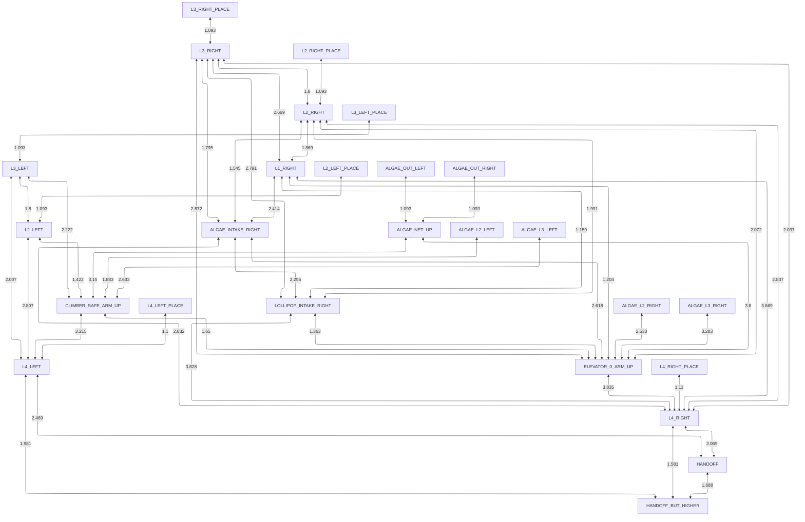

# Collision avoidance (left obstructed)

```mermaid
%%{ init: { "flowchart": { "defaultRenderer": "elk" } } }%%
graph TD

HANDOFF <-- 1.688 --> HANDOFF_BUT_HIGHER
L4_LEFT <-- 1.981 --> HANDOFF_BUT_HIGHER
L4_RIGHT <-- 1.581 --> HANDOFF_BUT_HIGHER
L4_LEFT <-- 2.469 --> HANDOFF
L4_RIGHT <-- 2.069 --> HANDOFF
CLIMBER_SAFE_ARM_UP <-- 3.215 --> L4_LEFT
L2_LEFT <-- 2.807 --> L4_LEFT
L3_LEFT <-- 2.007 --> L4_LEFT
L4_LEFT_PLACE <-- 1.1 --> L4_LEFT
ELEVATOR_0_ARM_UP <-- 3.835 --> L4_RIGHT
ALGAE_INTAKE_RIGHT <-- 2.832 --> L4_RIGHT
LOLLIPOP_INTAKE_RIGHT <-- 3.828 --> L4_RIGHT
L1_RIGHT <-- 3.669 --> L4_RIGHT
L2_RIGHT <-- 2.837 --> L4_RIGHT
L3_RIGHT <-- 2.037 --> L4_RIGHT
L4_RIGHT_PLACE <-- 1.13 --> L4_RIGHT
CLIMBER_SAFE_ARM_UP <-- 1.65 --> ELEVATOR_0_ARM_UP
LOLLIPOP_INTAKE_RIGHT <-- 1.363 --> ELEVATOR_0_ARM_UP
ALGAE_INTAKE_RIGHT <-- 2.618 --> ELEVATOR_0_ARM_UP
L1_RIGHT <-- 1.204 --> ELEVATOR_0_ARM_UP
L2_RIGHT <-- 2.072 --> ELEVATOR_0_ARM_UP
L3_RIGHT <-- 2.872 --> ELEVATOR_0_ARM_UP
ALGAE_NET_UP <-- 3.8 --> ELEVATOR_0_ARM_UP
ALGAE_L2_RIGHT <-- 2.533 --> ELEVATOR_0_ARM_UP
ALGAE_L3_RIGHT <-- 3.283 --> ELEVATOR_0_ARM_UP
L2_LEFT <-- 1.422 --> CLIMBER_SAFE_ARM_UP
L3_LEFT <-- 2.222 --> CLIMBER_SAFE_ARM_UP
ALGAE_NET_UP <-- 3.15 --> CLIMBER_SAFE_ARM_UP
ALGAE_L2_LEFT <-- 1.883 --> CLIMBER_SAFE_ARM_UP
ALGAE_L3_LEFT <-- 2.633 --> CLIMBER_SAFE_ARM_UP
ALGAE_INTAKE_RIGHT <-- 2.255 --> LOLLIPOP_INTAKE_RIGHT
L1_RIGHT <-- 1.159 --> LOLLIPOP_INTAKE_RIGHT
L2_RIGHT <-- 1.991 --> LOLLIPOP_INTAKE_RIGHT
L3_RIGHT <-- 2.791 --> LOLLIPOP_INTAKE_RIGHT
L1_RIGHT <-- 2.414 --> ALGAE_INTAKE_RIGHT
L2_RIGHT <-- 1.545 --> ALGAE_INTAKE_RIGHT
L3_RIGHT <-- 1.795 --> ALGAE_INTAKE_RIGHT
L3_LEFT <-- 1.8 --> L2_LEFT
L2_LEFT_PLACE <-- 1.093 --> L2_LEFT
L3_LEFT_PLACE <-- 1.093 --> L3_LEFT
ALGAE_OUT_LEFT <-- 1.093 --> ALGAE_NET_UP
ALGAE_OUT_RIGHT <-- 1.093 --> ALGAE_NET_UP
L2_RIGHT <-- 1.869 --> L1_RIGHT
L3_RIGHT <-- 2.669 --> L1_RIGHT
L3_RIGHT <-- 1.8 --> L2_RIGHT
L2_RIGHT_PLACE <-- 1.093 --> L2_RIGHT
L3_RIGHT_PLACE <-- 1.093 --> L3_RIGHT
```
