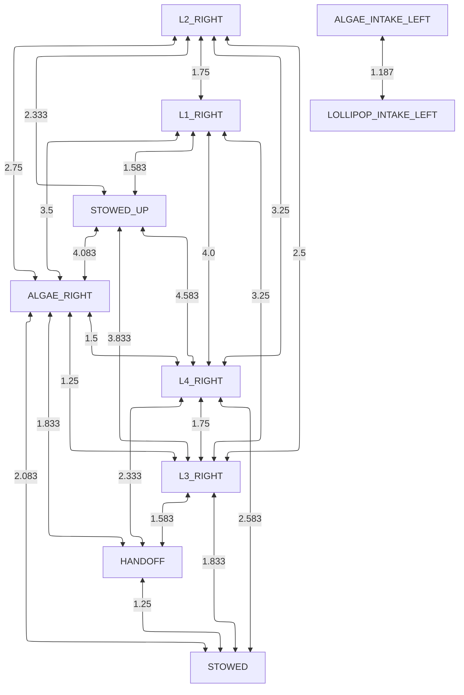

# Collision avoidance (left obstructed)

```mermaid
%%{ init: { "flowchart": { "defaultRenderer": "elk" } } }%%
graph TD

HANDOFF <-- 1.25 --> STOWED
L3_RIGHT <-- 1.833 --> STOWED
L4_RIGHT <-- 2.583 --> STOWED
ALGAE_RIGHT <-- 2.083 --> STOWED
L3_RIGHT <-- 1.583 --> HANDOFF
L4_RIGHT <-- 2.333 --> HANDOFF
ALGAE_RIGHT <-- 1.833 --> HANDOFF
STOWED_UP <-- 3.833 --> L3_RIGHT
L1_RIGHT <-- 3.25 --> L3_RIGHT
L2_RIGHT <-- 2.5 --> L3_RIGHT
L4_RIGHT <-- 1.75 --> L3_RIGHT
ALGAE_RIGHT <-- 1.25 --> L3_RIGHT
STOWED_UP <-- 4.583 --> L4_RIGHT
L1_RIGHT <-- 4.0 --> L4_RIGHT
L2_RIGHT <-- 3.25 --> L4_RIGHT
ALGAE_RIGHT <-- 1.5 --> L4_RIGHT
STOWED_UP <-- 4.083 --> ALGAE_RIGHT
L1_RIGHT <-- 3.5 --> ALGAE_RIGHT
L2_RIGHT <-- 2.75 --> ALGAE_RIGHT
L1_RIGHT <-- 1.583 --> STOWED_UP
L2_RIGHT <-- 2.333 --> STOWED_UP
ALGAE_INTAKE_LEFT <-- 1.187 --> LOLLIPOP_INTAKE_LEFT
L2_RIGHT <-- 1.75 --> L1_RIGHT
```
