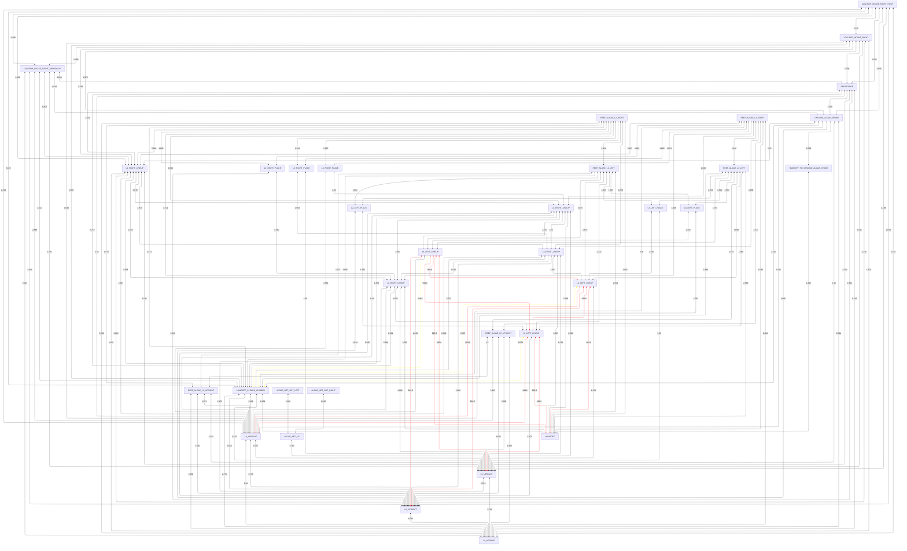

# Collision avoidance (left obstructed)

```mermaid
%%{ init: { "flowchart": { "defaultRenderer": "elk" } } }%%
graph TD

L2_UPRIGHT <-- 1.532 --> L1_UPRIGHT
L3_UPRIGHT <-- 1.742 --> L1_UPRIGHT
L4_UPRIGHT <-- 1.94 --> L1_UPRIGHT
REEF_ALGAE_L2_UPRIGHT <-- 1.658 --> L1_UPRIGHT
REEF_ALGAE_L3_UPRIGHT <-- 1.827 --> L1_UPRIGHT
REEF_ALGAE_L2_RIGHT <-- 2.236 --> L1_UPRIGHT
REEF_ALGAE_L3_RIGHT <-- 2.404 --> L1_UPRIGHT
PROCESSOR <-- 2.216 --> L1_UPRIGHT
L1_RIGHT_LINEUP <-- 1.451 --> L1_UPRIGHT
LOLLIPOP_INTAKE_RIGHT_APPROACH <-- 2.011 --> L1_UPRIGHT
LOLLIPOP_INTAKE_RIGHT <-- 1.602 --> L1_UPRIGHT
LOLLIPOP_INTAKE_RIGHT_PUSH <-- 2.138 --> L1_UPRIGHT
GROUND_ALGAE_INTAKE <-- 2.314 --> L1_UPRIGHT
HANDOFF_CLEARS_CLIMBER <-- 2.774 --> L1_UPRIGHT
L3_UPRIGHT <-- 1.516 --> L2_UPRIGHT
L4_UPRIGHT <-- 1.775 --> L2_UPRIGHT
REEF_ALGAE_L2_UPRIGHT <-- 1.387 --> L2_UPRIGHT
REEF_ALGAE_L3_UPRIGHT <-- 1.632 --> L2_UPRIGHT
L2_LEFT_LINEUP <-- 1.471 --> L2_UPRIGHT
L2_LEFT_PLACE <-- 1.819 --> L2_UPRIGHT
L2_RIGHT_LINEUP <-- 1.471 --> L2_UPRIGHT
L2_RIGHT_PLACE <-- 1.819 --> L2_UPRIGHT
L3_LEFT_LINEUP <-- 999.0 --> L2_UPRIGHT
L4_LEFT_LINEUP <-- 999.0 --> L2_UPRIGHT
L1_RIGHT_LINEUP <-- 1.984 --> L2_UPRIGHT
L3_RIGHT_LINEUP <-- 1.988 --> L2_UPRIGHT
L4_RIGHT_LINEUP <-- 2.205 --> L2_UPRIGHT
LOLLIPOP_INTAKE_RIGHT_APPROACH <-- 1.944 --> L2_UPRIGHT
LOLLIPOP_INTAKE_RIGHT <-- 2.135 --> L2_UPRIGHT
LOLLIPOP_INTAKE_RIGHT_PUSH <-- 1.821 --> L2_UPRIGHT
GROUND_ALGAE_INTAKE <-- 2.005 --> L2_UPRIGHT
PROCESSOR <-- 1.862 --> L2_UPRIGHT
HANDOFF_CLEARS_CLIMBER <-- 2.612 --> L2_UPRIGHT
L4_UPRIGHT <-- 1.577 --> L3_UPRIGHT
REEF_ALGAE_L2_UPRIGHT <-- 1.342 --> L3_UPRIGHT
REEF_ALGAE_L3_UPRIGHT <-- 1.365 --> L3_UPRIGHT
L3_LEFT_LINEUP <-- 1.471 --> L3_UPRIGHT
L3_LEFT_PLACE <-- 1.85 --> L3_UPRIGHT
L3_RIGHT_LINEUP <-- 1.471 --> L3_UPRIGHT
L3_RIGHT_PLACE <-- 1.85 --> L3_UPRIGHT
L2_LEFT_LINEUP <-- 999.0 --> L3_UPRIGHT
L4_LEFT_LINEUP <-- 999.0 --> L3_UPRIGHT
L1_RIGHT_LINEUP <-- 2.193 --> L3_UPRIGHT
L2_RIGHT_LINEUP <-- 1.988 --> L3_UPRIGHT
L4_RIGHT_LINEUP <-- 2.008 --> L3_UPRIGHT
ALGAE_NET_UP <-- 1.753 --> L3_UPRIGHT
LOLLIPOP_INTAKE_RIGHT_APPROACH <-- 2.222 --> L3_UPRIGHT
LOLLIPOP_INTAKE_RIGHT <-- 2.344 --> L3_UPRIGHT
LOLLIPOP_INTAKE_RIGHT_PUSH <-- 2.186 --> L3_UPRIGHT
GROUND_ALGAE_INTAKE <-- 2.12 --> L3_UPRIGHT
PROCESSOR <-- 2.104 --> L3_UPRIGHT
HANDOFF_CLEARS_CLIMBER <-- 2.422 --> L3_UPRIGHT
REEF_ALGAE_L2_UPRIGHT <-- 1.671 --> L4_UPRIGHT
REEF_ALGAE_L3_UPRIGHT <-- 1.447 --> L4_UPRIGHT
L4_LEFT_LINEUP <-- 1.463 --> L4_UPRIGHT
L4_LEFT_PLACE <-- 1.561 --> L4_UPRIGHT
L4_RIGHT_LINEUP <-- 1.43 --> L4_UPRIGHT
L4_RIGHT_PLACE <-- 1.561 --> L4_UPRIGHT
L2_LEFT_LINEUP <-- 999.0 --> L4_UPRIGHT
L3_LEFT_LINEUP <-- 999.0 --> L4_UPRIGHT
L1_RIGHT_LINEUP <-- 2.391 --> L4_UPRIGHT
L2_RIGHT_LINEUP <-- 2.246 --> L4_UPRIGHT
L3_RIGHT_LINEUP <-- 2.049 --> L4_UPRIGHT
LOLLIPOP_INTAKE_RIGHT_APPROACH <-- 2.449 --> L4_UPRIGHT
LOLLIPOP_INTAKE_RIGHT <-- 2.542 --> L4_UPRIGHT
LOLLIPOP_INTAKE_RIGHT_PUSH <-- 2.434 --> L4_UPRIGHT
GROUND_ALGAE_INTAKE <-- 2.415 --> L4_UPRIGHT
PROCESSOR <-- 2.38 --> L4_UPRIGHT
HANDOFF_CLEARS_CLIMBER <-- 1.999 --> L4_UPRIGHT
REEF_ALGAE_L3_UPRIGHT <-- 1.5 --> REEF_ALGAE_L2_UPRIGHT
REEF_ALGAE_L2_LEFT <-- 1.577 --> REEF_ALGAE_L2_UPRIGHT
REEF_ALGAE_L2_RIGHT <-- 1.577 --> REEF_ALGAE_L2_UPRIGHT
REEF_ALGAE_L3_LEFT <-- 1.577 --> REEF_ALGAE_L3_UPRIGHT
REEF_ALGAE_L3_RIGHT <-- 1.577 --> REEF_ALGAE_L3_UPRIGHT
HANDOFF_CLEARS_CLIMBER <-- 1.479 --> HANDOFF
L2_LEFT_LINEUP <-- 999.0 --> HANDOFF
L3_LEFT_LINEUP <-- 999.0 --> HANDOFF
L4_LEFT_LINEUP <-- 999.0 --> HANDOFF
L2_RIGHT_LINEUP <-- 2.302 --> HANDOFF
L3_RIGHT_LINEUP <-- 2.037 --> HANDOFF
L4_RIGHT_LINEUP <-- 2.136 --> HANDOFF
REEF_ALGAE_L2_RIGHT <-- 2.081 --> HANDOFF
REEF_ALGAE_L3_RIGHT <-- 1.642 --> HANDOFF
REEF_ALGAE_L2_LEFT <-- 2.504 --> HANDOFF
REEF_ALGAE_L3_LEFT <-- 2.065 --> HANDOFF
HANDOFF_TO_GROUND_ALGAE_INTAKE <-- 1.417 --> HANDOFF
L2_LEFT_LINEUP <-- 2.678 --> HANDOFF_CLEARS_CLIMBER
L3_LEFT_LINEUP <-- 2.487 --> HANDOFF_CLEARS_CLIMBER
L4_LEFT_LINEUP <-- 2.069 --> HANDOFF_CLEARS_CLIMBER
L2_RIGHT_LINEUP <-- 2.462 --> HANDOFF_CLEARS_CLIMBER
L3_RIGHT_LINEUP <-- 2.272 --> HANDOFF_CLEARS_CLIMBER
L4_RIGHT_LINEUP <-- 1.876 --> HANDOFF_CLEARS_CLIMBER
REEF_ALGAE_L2_LEFT <-- 2.695 --> HANDOFF_CLEARS_CLIMBER
REEF_ALGAE_L3_LEFT <-- 2.483 --> HANDOFF_CLEARS_CLIMBER
REEF_ALGAE_L2_RIGHT <-- 2.273 --> HANDOFF_CLEARS_CLIMBER
REEF_ALGAE_L3_RIGHT <-- 2.06 --> HANDOFF_CLEARS_CLIMBER
L1_RIGHT_LINEUP <-- 2.638 --> HANDOFF_CLEARS_CLIMBER
LOLLIPOP_INTAKE_RIGHT_APPROACH <-- 2.417 --> HANDOFF_CLEARS_CLIMBER
LOLLIPOP_INTAKE_RIGHT <-- 2.509 --> HANDOFF_CLEARS_CLIMBER
LOLLIPOP_INTAKE_RIGHT_PUSH <-- 2.326 --> HANDOFF_CLEARS_CLIMBER
GROUND_ALGAE_INTAKE <-- 2.153 --> HANDOFF_CLEARS_CLIMBER
PROCESSOR <-- 2.273 --> HANDOFF_CLEARS_CLIMBER
L2_LEFT_PLACE <-- 1.562 --> L2_LEFT_LINEUP
L2_RIGHT_LINEUP <-- 1.667 --> L2_LEFT_LINEUP
L3_LEFT_LINEUP <-- 999.0 --> L2_LEFT_LINEUP
L4_LEFT_LINEUP <-- 999.0 --> L2_LEFT_LINEUP
REEF_ALGAE_L2_LEFT <-- 1.721 --> L2_LEFT_LINEUP
REEF_ALGAE_L3_LEFT <-- 1.966 --> L2_LEFT_LINEUP
REEF_ALGAE_L2_LEFT <-- 1.602 --> L2_LEFT_PLACE
REEF_ALGAE_L3_LEFT <-- 1.819 --> L2_LEFT_PLACE
L2_RIGHT_PLACE <-- 1.562 --> L2_RIGHT_LINEUP
L1_RIGHT_LINEUP <-- 1.668 --> L2_RIGHT_LINEUP
L3_RIGHT_LINEUP <-- 1.516 --> L2_RIGHT_LINEUP
L4_RIGHT_LINEUP <-- 1.967 --> L2_RIGHT_LINEUP
REEF_ALGAE_L2_RIGHT <-- 1.721 --> L2_RIGHT_LINEUP
REEF_ALGAE_L3_RIGHT <-- 1.966 --> L2_RIGHT_LINEUP
REEF_ALGAE_L2_RIGHT <-- 1.602 --> L2_RIGHT_PLACE
REEF_ALGAE_L3_RIGHT <-- 1.819 --> L2_RIGHT_PLACE
L3_LEFT_PLACE <-- 1.593 --> L3_LEFT_LINEUP
L3_RIGHT_LINEUP <-- 1.667 --> L3_LEFT_LINEUP
L4_LEFT_LINEUP <-- 999.0 --> L3_LEFT_LINEUP
REEF_ALGAE_L2_LEFT <-- 1.675 --> L3_LEFT_LINEUP
REEF_ALGAE_L3_LEFT <-- 1.698 --> L3_LEFT_LINEUP
REEF_ALGAE_L2_LEFT <-- 1.319 --> L3_LEFT_PLACE
REEF_ALGAE_L3_LEFT <-- 1.602 --> L3_LEFT_PLACE
L3_RIGHT_PLACE <-- 1.593 --> L3_RIGHT_LINEUP
L1_RIGHT_LINEUP <-- 1.878 --> L3_RIGHT_LINEUP
L4_RIGHT_LINEUP <-- 1.77 --> L3_RIGHT_LINEUP
REEF_ALGAE_L2_RIGHT <-- 1.675 --> L3_RIGHT_LINEUP
REEF_ALGAE_L3_RIGHT <-- 1.698 --> L3_RIGHT_LINEUP
REEF_ALGAE_L2_RIGHT <-- 1.319 --> L3_RIGHT_PLACE
REEF_ALGAE_L3_RIGHT <-- 1.602 --> L3_RIGHT_PLACE
L4_LEFT_PLACE <-- 1.316 --> L4_LEFT_LINEUP
L4_RIGHT_LINEUP <-- 1.632 --> L4_LEFT_LINEUP
REEF_ALGAE_L2_LEFT <-- 2.015 --> L4_LEFT_LINEUP
REEF_ALGAE_L3_LEFT <-- 1.791 --> L4_LEFT_LINEUP
REEF_ALGAE_L2_LEFT <-- 1.807 --> L4_LEFT_PLACE
REEF_ALGAE_L3_LEFT <-- 1.583 --> L4_LEFT_PLACE
L4_RIGHT_PLACE <-- 1.36 --> L4_RIGHT_LINEUP
L1_RIGHT_LINEUP <-- 2.076 --> L4_RIGHT_LINEUP
REEF_ALGAE_L2_RIGHT <-- 2.056 --> L4_RIGHT_LINEUP
REEF_ALGAE_L3_RIGHT <-- 1.832 --> L4_RIGHT_LINEUP
REEF_ALGAE_L2_RIGHT <-- 1.807 --> L4_RIGHT_PLACE
REEF_ALGAE_L3_RIGHT <-- 1.583 --> L4_RIGHT_PLACE
REEF_ALGAE_L2_RIGHT <-- 2.018 --> L1_RIGHT_LINEUP
REEF_ALGAE_L3_RIGHT <-- 2.187 --> L1_RIGHT_LINEUP
LOLLIPOP_INTAKE_RIGHT_APPROACH <-- 1.807 --> L1_RIGHT_LINEUP
LOLLIPOP_INTAKE_RIGHT <-- 1.399 --> L1_RIGHT_LINEUP
LOLLIPOP_INTAKE_RIGHT_PUSH <-- 1.951 --> L1_RIGHT_LINEUP
GROUND_ALGAE_INTAKE <-- 2.15 --> L1_RIGHT_LINEUP
PROCESSOR <-- 2.029 --> L1_RIGHT_LINEUP
REEF_ALGAE_L2_RIGHT <-- 1.816 --> REEF_ALGAE_L2_LEFT
REEF_ALGAE_L3_RIGHT <-- 1.816 --> REEF_ALGAE_L3_LEFT
ALGAE_NET_OUT_LEFT <-- 1.385 --> ALGAE_NET_UP
ALGAE_NET_OUT_RIGHT <-- 1.385 --> ALGAE_NET_UP
GROUND_ALGAE_INTAKE <-- 1.559 --> HANDOFF_TO_GROUND_ALGAE_INTAKE
PROCESSOR <-- 1.496 --> GROUND_ALGAE_INTAKE
LOLLIPOP_INTAKE_RIGHT_APPROACH <-- 1.816 --> GROUND_ALGAE_INTAKE
LOLLIPOP_INTAKE_RIGHT <-- 1.972 --> GROUND_ALGAE_INTAKE
LOLLIPOP_INTAKE_RIGHT_PUSH <-- 1.645 --> GROUND_ALGAE_INTAKE
LOLLIPOP_INTAKE_RIGHT_APPROACH <-- 1.619 --> PROCESSOR
LOLLIPOP_INTAKE_RIGHT <-- 1.788 --> PROCESSOR
LOLLIPOP_INTAKE_RIGHT_PUSH <-- 1.289 --> PROCESSOR
LOLLIPOP_INTAKE_RIGHT <-- 1.408 --> LOLLIPOP_INTAKE_RIGHT_APPROACH
LOLLIPOP_INTAKE_RIGHT_PUSH <-- 1.499 --> LOLLIPOP_INTAKE_RIGHT_APPROACH
LOLLIPOP_INTAKE_RIGHT_PUSH <-- 1.711 --> LOLLIPOP_INTAKE_RIGHT

linkStyle 22,23,40,41,58,59,75,76,77,104,105,120 stroke:red;

linkStyle 86,87,88 stroke:yellow;
```
