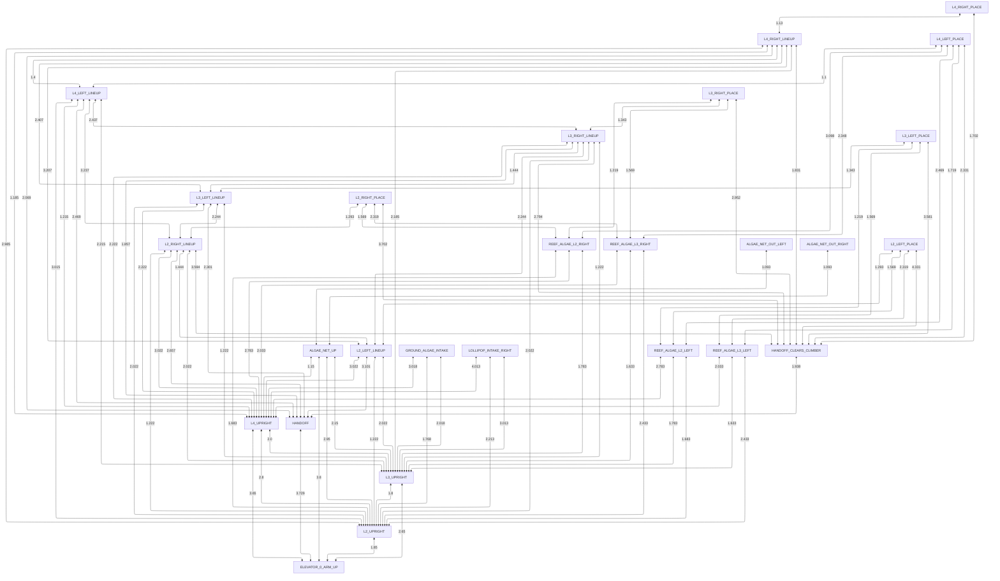

# Collision avoidance (unobstructed)

```mermaid
%%{ init: { "flowchart": { "defaultRenderer": "elk" } } }%%
graph TD

L2_UPRIGHT <-- 1.85 --> ELEVATOR_0_ARM_UP
L3_UPRIGHT <-- 2.65 --> ELEVATOR_0_ARM_UP
L4_UPRIGHT <-- 3.65 --> ELEVATOR_0_ARM_UP
ALGAE_NET_UP <-- 3.8 --> ELEVATOR_0_ARM_UP
HANDOFF <-- 3.729 --> ELEVATOR_0_ARM_UP
L3_UPRIGHT <-- 1.8 --> L2_UPRIGHT
L4_UPRIGHT <-- 2.8 --> L2_UPRIGHT
ALGAE_NET_UP <-- 2.95 --> L2_UPRIGHT
L2_LEFT_LINEUP <-- 1.222 --> L2_UPRIGHT
L2_RIGHT_LINEUP <-- 1.222 --> L2_UPRIGHT
GROUND_ALGAE_INTAKE <-- 1.768 --> L2_UPRIGHT
LOLLIPOP_INTAKE_RIGHT <-- 2.213 --> L2_UPRIGHT
REEF_ALGAE_L2_LEFT <-- 1.683 --> L2_UPRIGHT
REEF_ALGAE_L3_LEFT <-- 2.433 --> L2_UPRIGHT
REEF_ALGAE_L2_RIGHT <-- 1.683 --> L2_UPRIGHT
REEF_ALGAE_L3_RIGHT <-- 2.433 --> L2_UPRIGHT
L3_LEFT_LINEUP <-- 2.022 --> L2_UPRIGHT
L4_LEFT_LINEUP <-- 3.015 --> L2_UPRIGHT
L3_RIGHT_LINEUP <-- 2.022 --> L2_UPRIGHT
L4_RIGHT_LINEUP <-- 2.985 --> L2_UPRIGHT
L4_UPRIGHT <-- 2.0 --> L3_UPRIGHT
ALGAE_NET_UP <-- 2.15 --> L3_UPRIGHT
L3_LEFT_LINEUP <-- 1.222 --> L3_UPRIGHT
L3_RIGHT_LINEUP <-- 1.222 --> L3_UPRIGHT
GROUND_ALGAE_INTAKE <-- 2.018 --> L3_UPRIGHT
LOLLIPOP_INTAKE_RIGHT <-- 3.013 --> L3_UPRIGHT
REEF_ALGAE_L2_LEFT <-- 1.783 --> L3_UPRIGHT
REEF_ALGAE_L3_LEFT <-- 1.633 --> L3_UPRIGHT
REEF_ALGAE_L2_RIGHT <-- 1.783 --> L3_UPRIGHT
REEF_ALGAE_L3_RIGHT <-- 1.633 --> L3_UPRIGHT
L2_LEFT_LINEUP <-- 2.022 --> L3_UPRIGHT
L4_LEFT_LINEUP <-- 2.215 --> L3_UPRIGHT
L2_RIGHT_LINEUP <-- 2.022 --> L3_UPRIGHT
L4_RIGHT_LINEUP <-- 2.185 --> L3_UPRIGHT
ALGAE_NET_UP <-- 1.15 --> L4_UPRIGHT
L4_LEFT_LINEUP <-- 1.215 --> L4_UPRIGHT
L4_RIGHT_LINEUP <-- 1.185 --> L4_UPRIGHT
GROUND_ALGAE_INTAKE <-- 3.018 --> L4_UPRIGHT
LOLLIPOP_INTAKE_RIGHT <-- 4.013 --> L4_UPRIGHT
REEF_ALGAE_L2_LEFT <-- 2.783 --> L4_UPRIGHT
REEF_ALGAE_L3_LEFT <-- 2.033 --> L4_UPRIGHT
REEF_ALGAE_L2_RIGHT <-- 2.783 --> L4_UPRIGHT
REEF_ALGAE_L3_RIGHT <-- 2.033 --> L4_UPRIGHT
L2_LEFT_LINEUP <-- 3.022 --> L4_UPRIGHT
L3_LEFT_LINEUP <-- 2.222 --> L4_UPRIGHT
L2_RIGHT_LINEUP <-- 3.022 --> L4_UPRIGHT
L3_RIGHT_LINEUP <-- 2.222 --> L4_UPRIGHT
ALGAE_NET_OUT_LEFT <-- 1.093 --> ALGAE_NET_UP
ALGAE_NET_OUT_RIGHT <-- 1.093 --> ALGAE_NET_UP
HANDOFF_CLEARS_CLIMBER <-- 1.938 --> HANDOFF
L2_RIGHT_LINEUP <-- 2.657 --> HANDOFF
L3_RIGHT_LINEUP <-- 1.857 --> HANDOFF
L4_RIGHT_LINEUP <-- 2.069 --> HANDOFF
L2_LEFT_LINEUP <-- 3.101 --> HANDOFF
L3_LEFT_LINEUP <-- 2.301 --> HANDOFF
L4_LEFT_LINEUP <-- 2.469 --> HANDOFF
L2_RIGHT_LINEUP <-- 3.594 --> HANDOFF_CLEARS_CLIMBER
L3_RIGHT_LINEUP <-- 2.794 --> HANDOFF_CLEARS_CLIMBER
L4_RIGHT_LINEUP <-- 1.831 --> HANDOFF_CLEARS_CLIMBER
L2_LEFT_PLACE <-- 4.331 --> HANDOFF_CLEARS_CLIMBER
L3_LEFT_PLACE <-- 3.581 --> HANDOFF_CLEARS_CLIMBER
L4_LEFT_PLACE <-- 2.331 --> HANDOFF_CLEARS_CLIMBER
L2_RIGHT_PLACE <-- 3.702 --> HANDOFF_CLEARS_CLIMBER
L3_RIGHT_PLACE <-- 2.952 --> HANDOFF_CLEARS_CLIMBER
L4_RIGHT_PLACE <-- 1.702 --> HANDOFF_CLEARS_CLIMBER
L2_RIGHT_LINEUP <-- 1.444 --> L2_LEFT_LINEUP
L3_RIGHT_LINEUP <-- 2.244 --> L2_LEFT_LINEUP
L4_RIGHT_LINEUP <-- 3.207 --> L2_LEFT_LINEUP
L2_LEFT_PLACE <-- 1.293 --> L2_LEFT_LINEUP
L3_LEFT_LINEUP <-- 2.244 --> L2_RIGHT_LINEUP
L4_LEFT_LINEUP <-- 3.237 --> L2_RIGHT_LINEUP
L2_RIGHT_PLACE <-- 1.293 --> L2_RIGHT_LINEUP
L2_LEFT_PLACE <-- 1.569 --> REEF_ALGAE_L2_LEFT
L3_LEFT_PLACE <-- 1.219 --> REEF_ALGAE_L2_LEFT
L4_LEFT_PLACE <-- 2.469 --> REEF_ALGAE_L2_LEFT
L2_LEFT_PLACE <-- 2.319 --> REEF_ALGAE_L3_LEFT
L3_LEFT_PLACE <-- 1.569 --> REEF_ALGAE_L3_LEFT
L4_LEFT_PLACE <-- 1.719 --> REEF_ALGAE_L3_LEFT
L2_RIGHT_PLACE <-- 1.569 --> REEF_ALGAE_L2_RIGHT
L3_RIGHT_PLACE <-- 1.219 --> REEF_ALGAE_L2_RIGHT
L4_LEFT_PLACE <-- 3.098 --> REEF_ALGAE_L2_RIGHT
L2_RIGHT_PLACE <-- 2.319 --> REEF_ALGAE_L3_RIGHT
L3_RIGHT_PLACE <-- 1.569 --> REEF_ALGAE_L3_RIGHT
L4_LEFT_PLACE <-- 2.348 --> REEF_ALGAE_L3_RIGHT
L3_RIGHT_LINEUP <-- 1.444 --> L3_LEFT_LINEUP
L4_RIGHT_LINEUP <-- 2.407 --> L3_LEFT_LINEUP
L3_LEFT_PLACE <-- 1.343 --> L3_LEFT_LINEUP
L4_LEFT_LINEUP <-- 2.437 --> L3_RIGHT_LINEUP
L3_RIGHT_PLACE <-- 1.343 --> L3_RIGHT_LINEUP
L4_RIGHT_LINEUP <-- 1.4 --> L4_LEFT_LINEUP
L4_LEFT_PLACE <-- 1.1 --> L4_LEFT_LINEUP
L4_RIGHT_PLACE <-- 1.13 --> L4_RIGHT_LINEUP
```
