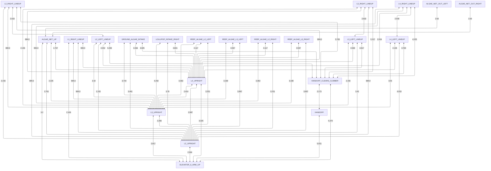

# Collision avoidance (right obstructed)

```mermaid
%%{ init: { "flowchart": { "defaultRenderer": "elk" } } }%%
graph TD

L2_UPRIGHT <-- 2.304 --> ELEVATOR_0_ARM_UP
L3_UPRIGHT <-- 2.817 --> ELEVATOR_0_ARM_UP
L4_UPRIGHT <-- 3.325 --> ELEVATOR_0_ARM_UP
ALGAE_NET_UP <-- 3.2 --> ELEVATOR_0_ARM_UP
HANDOFF <-- 5.031 --> ELEVATOR_0_ARM_UP
HANDOFF_CLEARS_CLIMBER <-- 5.375 --> ELEVATOR_0_ARM_UP
L1_RIGHT_LINEUP <-- 2.106 --> ELEVATOR_0_ARM_UP
L3_UPRIGHT <-- 2.265 --> L2_UPRIGHT
L4_UPRIGHT <-- 2.897 --> L2_UPRIGHT
ALGAE_NET_UP <-- 2.761 --> L2_UPRIGHT
L2_LEFT_LINEUP <-- 2.155 --> L2_UPRIGHT
L2_RIGHT_LINEUP <-- 2.155 --> L2_UPRIGHT
GROUND_ALGAE_INTAKE <-- 3.461 --> L2_UPRIGHT
LOLLIPOP_INTAKE_RIGHT <-- 3.78 --> L2_UPRIGHT
REEF_ALGAE_L2_LEFT <-- 3.251 --> L2_UPRIGHT
REEF_ALGAE_L3_LEFT <-- 3.897 --> L2_UPRIGHT
REEF_ALGAE_L2_RIGHT <-- 3.251 --> L2_UPRIGHT
REEF_ALGAE_L3_RIGHT <-- 3.897 --> L2_UPRIGHT
L3_LEFT_LINEUP <-- 3.42 --> L2_UPRIGHT
L4_LEFT_LINEUP <-- 4.033 --> L2_UPRIGHT
L1_RIGHT_LINEUP <-- 999.0 --> L2_UPRIGHT
L3_RIGHT_LINEUP <-- 999.0 --> L2_UPRIGHT
L4_RIGHT_LINEUP <-- 999.0 --> L2_UPRIGHT
L4_UPRIGHT <-- 2.414 --> L3_UPRIGHT
ALGAE_NET_UP <-- 2.225 --> L3_UPRIGHT
L3_LEFT_LINEUP <-- 2.155 --> L3_UPRIGHT
L3_RIGHT_LINEUP <-- 2.155 --> L3_UPRIGHT
GROUND_ALGAE_INTAKE <-- 3.744 --> L3_UPRIGHT
LOLLIPOP_INTAKE_RIGHT <-- 4.292 --> L3_UPRIGHT
REEF_ALGAE_L2_LEFT <-- 3.363 --> L3_UPRIGHT
REEF_ALGAE_L3_LEFT <-- 3.189 --> L3_UPRIGHT
REEF_ALGAE_L2_RIGHT <-- 3.363 --> L3_UPRIGHT
REEF_ALGAE_L3_RIGHT <-- 3.189 --> L3_UPRIGHT
L2_LEFT_LINEUP <-- 3.42 --> L3_UPRIGHT
L4_LEFT_LINEUP <-- 3.55 --> L3_UPRIGHT
L1_RIGHT_LINEUP <-- 999.0 --> L3_UPRIGHT
L2_RIGHT_LINEUP <-- 999.0 --> L3_UPRIGHT
L4_RIGHT_LINEUP <-- 999.0 --> L3_UPRIGHT
ALGAE_NET_UP <-- 1.707 --> L4_UPRIGHT
L4_LEFT_LINEUP <-- 2.135 --> L4_UPRIGHT
L4_RIGHT_LINEUP <-- 2.054 --> L4_UPRIGHT
GROUND_ALGAE_INTAKE <-- 4.466 --> L4_UPRIGHT
LOLLIPOP_INTAKE_RIGHT <-- 4.801 --> L4_UPRIGHT
REEF_ALGAE_L2_LEFT <-- 4.117 --> L4_UPRIGHT
REEF_ALGAE_L3_LEFT <-- 3.597 --> L4_UPRIGHT
REEF_ALGAE_L2_RIGHT <-- 4.117 --> L4_UPRIGHT
REEF_ALGAE_L3_RIGHT <-- 3.597 --> L4_UPRIGHT
L2_LEFT_LINEUP <-- 4.052 --> L4_UPRIGHT
L3_LEFT_LINEUP <-- 3.569 --> L4_UPRIGHT
L1_RIGHT_LINEUP <-- 999.0 --> L4_UPRIGHT
L2_RIGHT_LINEUP <-- 999.0 --> L4_UPRIGHT
L3_RIGHT_LINEUP <-- 999.0 --> L4_UPRIGHT
ALGAE_NET_OUT_LEFT <-- 2.64 --> ALGAE_NET_UP
ALGAE_NET_OUT_RIGHT <-- 2.64 --> ALGAE_NET_UP
HANDOFF_CLEARS_CLIMBER <-- 2.173 --> HANDOFF
L2_LEFT_LINEUP <-- 5.283 --> HANDOFF_CLEARS_CLIMBER
L3_LEFT_LINEUP <-- 4.817 --> HANDOFF_CLEARS_CLIMBER
L4_LEFT_LINEUP <-- 3.769 --> HANDOFF_CLEARS_CLIMBER
L2_RIGHT_LINEUP <-- 5.783 --> HANDOFF_CLEARS_CLIMBER
L3_RIGHT_LINEUP <-- 5.317 --> HANDOFF_CLEARS_CLIMBER
L4_RIGHT_LINEUP <-- 4.225 --> HANDOFF_CLEARS_CLIMBER
GROUND_ALGAE_INTAKE <-- 3.825 --> HANDOFF_CLEARS_CLIMBER
L2_RIGHT_LINEUP <-- 2.633 --> L2_LEFT_LINEUP
L3_RIGHT_LINEUP <-- 2.633 --> L3_LEFT_LINEUP
L4_RIGHT_LINEUP <-- 2.549 --> L4_LEFT_LINEUP
```
