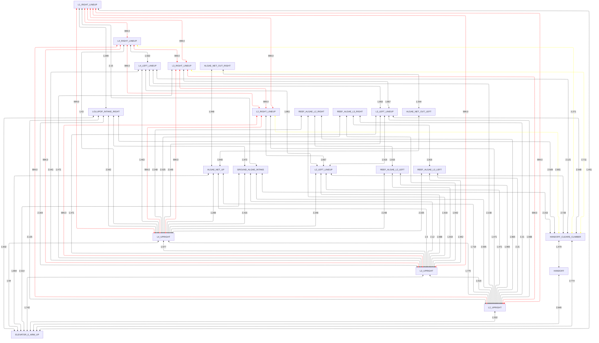

# Collision avoidance (right obstructed)

```mermaid
%%{ init: { "flowchart": { "defaultRenderer": "elk" } } }%%
graph TD

L2_UPRIGHT <-- 1.532 --> ELEVATOR_0_ARM_UP
L3_UPRIGHT <-- 1.742 --> ELEVATOR_0_ARM_UP
L4_UPRIGHT <-- 1.94 --> ELEVATOR_0_ARM_UP
ALGAE_NET_UP <-- 1.894 --> ELEVATOR_0_ARM_UP
HANDOFF <-- 2.646 --> ELEVATOR_0_ARM_UP
HANDOFF_CLEARS_CLIMBER <-- 2.774 --> ELEVATOR_0_ARM_UP
L1_RIGHT_LINEUP <-- 1.451 --> ELEVATOR_0_ARM_UP
GROUND_ALGAE_INTAKE <-- 2.314 --> ELEVATOR_0_ARM_UP
LOLLIPOP_INTAKE_RIGHT <-- 1.602 --> ELEVATOR_0_ARM_UP
L3_UPRIGHT <-- 1.516 --> L2_UPRIGHT
L4_UPRIGHT <-- 1.775 --> L2_UPRIGHT
ALGAE_NET_UP <-- 1.719 --> L2_UPRIGHT
L2_LEFT_LINEUP <-- 1.471 --> L2_UPRIGHT
L2_RIGHT_LINEUP <-- 1.471 --> L2_UPRIGHT
GROUND_ALGAE_INTAKE <-- 2.005 --> L2_UPRIGHT
LOLLIPOP_INTAKE_RIGHT <-- 2.135 --> L2_UPRIGHT
REEF_ALGAE_L2_LEFT <-- 1.965 --> L2_UPRIGHT
REEF_ALGAE_L3_LEFT <-- 2.21 --> L2_UPRIGHT
REEF_ALGAE_L2_RIGHT <-- 1.965 --> L2_UPRIGHT
REEF_ALGAE_L3_RIGHT <-- 2.21 --> L2_UPRIGHT
L3_LEFT_LINEUP <-- 1.988 --> L2_UPRIGHT
L4_LEFT_LINEUP <-- 2.238 --> L2_UPRIGHT
L1_RIGHT_LINEUP <-- 999.0 --> L2_UPRIGHT
L3_RIGHT_LINEUP <-- 999.0 --> L2_UPRIGHT
L4_RIGHT_LINEUP <-- 999.0 --> L2_UPRIGHT
L4_UPRIGHT <-- 1.577 --> L3_UPRIGHT
ALGAE_NET_UP <-- 1.5 --> L3_UPRIGHT
L3_LEFT_LINEUP <-- 1.471 --> L3_UPRIGHT
L3_RIGHT_LINEUP <-- 1.471 --> L3_UPRIGHT
GROUND_ALGAE_INTAKE <-- 2.12 --> L3_UPRIGHT
LOLLIPOP_INTAKE_RIGHT <-- 2.344 --> L3_UPRIGHT
REEF_ALGAE_L2_LEFT <-- 1.919 --> L3_UPRIGHT
REEF_ALGAE_L3_LEFT <-- 1.942 --> L3_UPRIGHT
REEF_ALGAE_L2_RIGHT <-- 1.919 --> L3_UPRIGHT
REEF_ALGAE_L3_RIGHT <-- 1.942 --> L3_UPRIGHT
L2_LEFT_LINEUP <-- 1.988 --> L3_UPRIGHT
L4_LEFT_LINEUP <-- 2.041 --> L3_UPRIGHT
L1_RIGHT_LINEUP <-- 999.0 --> L3_UPRIGHT
L2_RIGHT_LINEUP <-- 999.0 --> L3_UPRIGHT
L4_RIGHT_LINEUP <-- 999.0 --> L3_UPRIGHT
ALGAE_NET_UP <-- 1.289 --> L4_UPRIGHT
L4_LEFT_LINEUP <-- 1.463 --> L4_UPRIGHT
L4_RIGHT_LINEUP <-- 1.43 --> L4_UPRIGHT
GROUND_ALGAE_INTAKE <-- 2.415 --> L4_UPRIGHT
LOLLIPOP_INTAKE_RIGHT <-- 2.542 --> L4_UPRIGHT
REEF_ALGAE_L2_LEFT <-- 2.248 --> L4_UPRIGHT
REEF_ALGAE_L3_LEFT <-- 2.025 --> L4_UPRIGHT
REEF_ALGAE_L2_RIGHT <-- 2.248 --> L4_UPRIGHT
REEF_ALGAE_L3_RIGHT <-- 2.025 --> L4_UPRIGHT
L2_LEFT_LINEUP <-- 2.246 --> L4_UPRIGHT
L3_LEFT_LINEUP <-- 2.049 --> L4_UPRIGHT
L1_RIGHT_LINEUP <-- 999.0 --> L4_UPRIGHT
L2_RIGHT_LINEUP <-- 999.0 --> L4_UPRIGHT
L3_RIGHT_LINEUP <-- 999.0 --> L4_UPRIGHT
ALGAE_NET_OUT_LEFT <-- 1.948 --> ALGAE_NET_UP
ALGAE_NET_OUT_RIGHT <-- 1.948 --> ALGAE_NET_UP
HANDOFF_CLEARS_CLIMBER <-- 1.479 --> HANDOFF
L2_LEFT_LINEUP <-- 2.739 --> HANDOFF_CLEARS_CLIMBER
L3_LEFT_LINEUP <-- 2.548 --> HANDOFF_CLEARS_CLIMBER
L4_LEFT_LINEUP <-- 2.121 --> HANDOFF_CLEARS_CLIMBER
L2_RIGHT_LINEUP <-- 2.901 --> HANDOFF_CLEARS_CLIMBER
L3_RIGHT_LINEUP <-- 2.711 --> HANDOFF_CLEARS_CLIMBER
L4_RIGHT_LINEUP <-- 2.271 --> HANDOFF_CLEARS_CLIMBER
GROUND_ALGAE_INTAKE <-- 2.153 --> HANDOFF_CLEARS_CLIMBER
LOLLIPOP_INTAKE_RIGHT <-- 2.509 --> HANDOFF_CLEARS_CLIMBER
L2_RIGHT_LINEUP <-- 1.667 --> L2_LEFT_LINEUP
L3_LEFT_LINEUP <-- 1.516 --> L2_LEFT_LINEUP
L4_LEFT_LINEUP <-- 1.861 --> L2_LEFT_LINEUP
L1_RIGHT_LINEUP <-- 999.0 --> L2_RIGHT_LINEUP
L3_RIGHT_LINEUP <-- 999.0 --> L2_RIGHT_LINEUP
L4_RIGHT_LINEUP <-- 999.0 --> L2_RIGHT_LINEUP
L1_RIGHT_LINEUP <-- 2.15 --> GROUND_ALGAE_INTAKE
LOLLIPOP_INTAKE_RIGHT <-- 1.972 --> GROUND_ALGAE_INTAKE
L1_RIGHT_LINEUP <-- 1.399 --> LOLLIPOP_INTAKE_RIGHT
REEF_ALGAE_L2_RIGHT <-- 1.816 --> REEF_ALGAE_L2_LEFT
REEF_ALGAE_L3_RIGHT <-- 1.816 --> REEF_ALGAE_L3_LEFT
L3_RIGHT_LINEUP <-- 1.667 --> L3_LEFT_LINEUP
L4_LEFT_LINEUP <-- 1.663 --> L3_LEFT_LINEUP
L1_RIGHT_LINEUP <-- 999.0 --> L3_RIGHT_LINEUP
L4_RIGHT_LINEUP <-- 999.0 --> L3_RIGHT_LINEUP
L4_RIGHT_LINEUP <-- 1.632 --> L4_LEFT_LINEUP
L1_RIGHT_LINEUP <-- 999.0 --> L4_RIGHT_LINEUP
ALGAE_NET_OUT_RIGHT <-- 1.544 --> ALGAE_NET_OUT_LEFT

linkStyle 22,23,24,37,38,39,51,52,53,68,69,70,78,79,81 stroke:red;

linkStyle 60,61,62 stroke:yellow;
```
