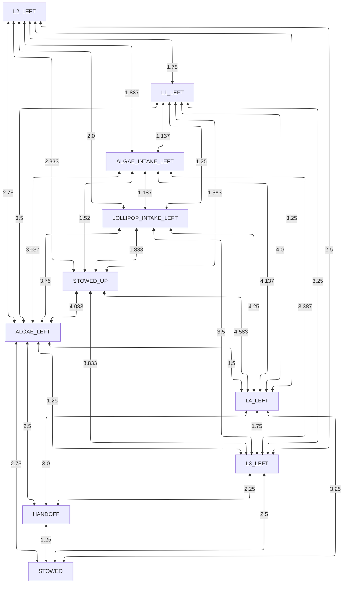

# Collision avoidance (right obstructed)

```mermaid
%%{ init: { "flowchart": { "defaultRenderer": "elk" } } }%%
graph TD

HANDOFF <-- 1.25 --> STOWED
L3_LEFT <-- 2.5 --> STOWED
L4_LEFT <-- 3.25 --> STOWED
ALGAE_LEFT <-- 2.75 --> STOWED
L3_LEFT <-- 2.25 --> HANDOFF
L4_LEFT <-- 3.0 --> HANDOFF
ALGAE_LEFT <-- 2.5 --> HANDOFF
STOWED_UP <-- 3.833 --> L3_LEFT
ALGAE_INTAKE_LEFT <-- 3.387 --> L3_LEFT
LOLLIPOP_INTAKE_LEFT <-- 3.5 --> L3_LEFT
L1_LEFT <-- 3.25 --> L3_LEFT
L2_LEFT <-- 2.5 --> L3_LEFT
L4_LEFT <-- 1.75 --> L3_LEFT
ALGAE_LEFT <-- 1.25 --> L3_LEFT
STOWED_UP <-- 4.583 --> L4_LEFT
ALGAE_INTAKE_LEFT <-- 4.137 --> L4_LEFT
LOLLIPOP_INTAKE_LEFT <-- 4.25 --> L4_LEFT
L1_LEFT <-- 4.0 --> L4_LEFT
L2_LEFT <-- 3.25 --> L4_LEFT
ALGAE_LEFT <-- 1.5 --> L4_LEFT
STOWED_UP <-- 4.083 --> ALGAE_LEFT
ALGAE_INTAKE_LEFT <-- 3.637 --> ALGAE_LEFT
LOLLIPOP_INTAKE_LEFT <-- 3.75 --> ALGAE_LEFT
L1_LEFT <-- 3.5 --> ALGAE_LEFT
L2_LEFT <-- 2.75 --> ALGAE_LEFT
LOLLIPOP_INTAKE_LEFT <-- 1.333 --> STOWED_UP
ALGAE_INTAKE_LEFT <-- 1.52 --> STOWED_UP
L1_LEFT <-- 1.583 --> STOWED_UP
L2_LEFT <-- 2.333 --> STOWED_UP
ALGAE_INTAKE_LEFT <-- 1.187 --> LOLLIPOP_INTAKE_LEFT
L1_LEFT <-- 1.25 --> LOLLIPOP_INTAKE_LEFT
L2_LEFT <-- 2.0 --> LOLLIPOP_INTAKE_LEFT
L1_LEFT <-- 1.137 --> ALGAE_INTAKE_LEFT
L2_LEFT <-- 1.887 --> ALGAE_INTAKE_LEFT
L2_LEFT <-- 1.75 --> L1_LEFT
```
