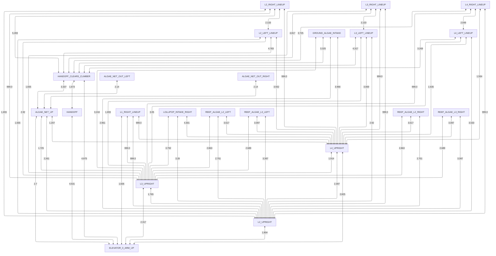

# Collision avoidance (right obstructed)

```mermaid
%%{ init: { "flowchart": { "defaultRenderer": "elk" } } }%%
graph TD

L2_UPRIGHT <-- 1.804 --> ELEVATOR_0_ARM_UP
L3_UPRIGHT <-- 2.317 --> ELEVATOR_0_ARM_UP
L4_UPRIGHT <-- 2.825 --> ELEVATOR_0_ARM_UP
ALGAE_NET_UP <-- 2.7 --> ELEVATOR_0_ARM_UP
HANDOFF <-- 4.531 --> ELEVATOR_0_ARM_UP
HANDOFF_CLEARS_CLIMBER <-- 4.875 --> ELEVATOR_0_ARM_UP
L1_RIGHT_LINEUP <-- 1.606 --> ELEVATOR_0_ARM_UP
L3_UPRIGHT <-- 1.765 --> L2_UPRIGHT
L4_UPRIGHT <-- 2.397 --> L2_UPRIGHT
ALGAE_NET_UP <-- 2.261 --> L2_UPRIGHT
L2_LEFT_LINEUP <-- 1.655 --> L2_UPRIGHT
L2_RIGHT_LINEUP <-- 1.655 --> L2_UPRIGHT
GROUND_ALGAE_INTAKE <-- 2.961 --> L2_UPRIGHT
LOLLIPOP_INTAKE_RIGHT <-- 3.28 --> L2_UPRIGHT
REEF_ALGAE_L2_LEFT <-- 2.751 --> L2_UPRIGHT
REEF_ALGAE_L3_LEFT <-- 3.397 --> L2_UPRIGHT
REEF_ALGAE_L2_RIGHT <-- 2.751 --> L2_UPRIGHT
REEF_ALGAE_L3_RIGHT <-- 3.397 --> L2_UPRIGHT
L3_LEFT_LINEUP <-- 2.92 --> L2_UPRIGHT
L4_LEFT_LINEUP <-- 3.533 --> L2_UPRIGHT
L1_RIGHT_LINEUP <-- 999.0 --> L2_UPRIGHT
L3_RIGHT_LINEUP <-- 999.0 --> L2_UPRIGHT
L4_RIGHT_LINEUP <-- 999.0 --> L2_UPRIGHT
L4_UPRIGHT <-- 1.914 --> L3_UPRIGHT
ALGAE_NET_UP <-- 1.725 --> L3_UPRIGHT
L3_LEFT_LINEUP <-- 1.655 --> L3_UPRIGHT
L3_RIGHT_LINEUP <-- 1.655 --> L3_UPRIGHT
GROUND_ALGAE_INTAKE <-- 3.244 --> L3_UPRIGHT
LOLLIPOP_INTAKE_RIGHT <-- 3.792 --> L3_UPRIGHT
REEF_ALGAE_L2_LEFT <-- 2.863 --> L3_UPRIGHT
REEF_ALGAE_L3_LEFT <-- 2.689 --> L3_UPRIGHT
REEF_ALGAE_L2_RIGHT <-- 2.863 --> L3_UPRIGHT
REEF_ALGAE_L3_RIGHT <-- 2.689 --> L3_UPRIGHT
L2_LEFT_LINEUP <-- 2.92 --> L3_UPRIGHT
L4_LEFT_LINEUP <-- 3.05 --> L3_UPRIGHT
L1_RIGHT_LINEUP <-- 999.0 --> L3_UPRIGHT
L2_RIGHT_LINEUP <-- 999.0 --> L3_UPRIGHT
L4_RIGHT_LINEUP <-- 999.0 --> L3_UPRIGHT
ALGAE_NET_UP <-- 1.207 --> L4_UPRIGHT
L4_LEFT_LINEUP <-- 1.635 --> L4_UPRIGHT
L4_RIGHT_LINEUP <-- 1.554 --> L4_UPRIGHT
GROUND_ALGAE_INTAKE <-- 3.966 --> L4_UPRIGHT
LOLLIPOP_INTAKE_RIGHT <-- 4.301 --> L4_UPRIGHT
REEF_ALGAE_L2_LEFT <-- 3.617 --> L4_UPRIGHT
REEF_ALGAE_L3_LEFT <-- 3.097 --> L4_UPRIGHT
REEF_ALGAE_L2_RIGHT <-- 3.617 --> L4_UPRIGHT
REEF_ALGAE_L3_RIGHT <-- 3.097 --> L4_UPRIGHT
L2_LEFT_LINEUP <-- 3.552 --> L4_UPRIGHT
L3_LEFT_LINEUP <-- 3.069 --> L4_UPRIGHT
L1_RIGHT_LINEUP <-- 999.0 --> L4_UPRIGHT
L2_RIGHT_LINEUP <-- 999.0 --> L4_UPRIGHT
L3_RIGHT_LINEUP <-- 999.0 --> L4_UPRIGHT
HANDOFF_CLEARS_CLIMBER <-- 3.337 --> ALGAE_NET_UP
ALGAE_NET_OUT_LEFT <-- 2.14 --> ALGAE_NET_UP
ALGAE_NET_OUT_RIGHT <-- 2.14 --> ALGAE_NET_UP
HANDOFF_CLEARS_CLIMBER <-- 1.673 --> HANDOFF
L2_LEFT_LINEUP <-- 4.783 --> HANDOFF_CLEARS_CLIMBER
L3_LEFT_LINEUP <-- 4.317 --> HANDOFF_CLEARS_CLIMBER
L4_LEFT_LINEUP <-- 3.269 --> HANDOFF_CLEARS_CLIMBER
L2_RIGHT_LINEUP <-- 5.283 --> HANDOFF_CLEARS_CLIMBER
L3_RIGHT_LINEUP <-- 4.817 --> HANDOFF_CLEARS_CLIMBER
L4_RIGHT_LINEUP <-- 3.725 --> HANDOFF_CLEARS_CLIMBER
GROUND_ALGAE_INTAKE <-- 3.325 --> HANDOFF_CLEARS_CLIMBER
L2_RIGHT_LINEUP <-- 2.133 --> L2_LEFT_LINEUP
L3_RIGHT_LINEUP <-- 2.133 --> L3_LEFT_LINEUP
L4_RIGHT_LINEUP <-- 2.049 --> L4_LEFT_LINEUP
```
